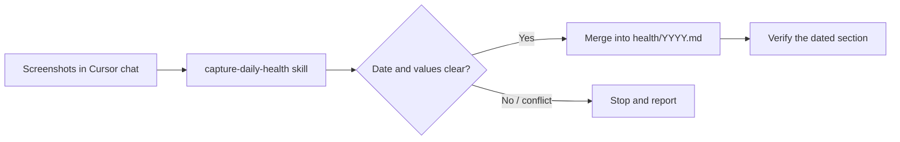

# My Wellness Pal

Screenshot-only personal health log for [Cursor](https://cursor.com) — drop in app screenshots, get a local Markdown record, keep private data off GitHub.

## Quick start

**Requirements:** [Cursor](https://cursor.com), and screenshots from [Outsiders App](https://outsiders.app) and/or iOS Health (State of Mind).

```bash
git clone https://github.com/mwallis-dev/my-wellness-pal.git
cd my-wellness-pal
```

1. Open the folder in Cursor.
2. Confirm `health/` is gitignored (it already is).
3. Attach or paste approved screenshots in chat.
4. A recognisable batch is authorization to extract and save — no extra “log this” command.

Dry run without writing: ask for **assessment**, **preview**, or **no save**.

## Features

| Capability | Detail |
| --- | --- |
| Screenshot capture | Outsiders readiness, body metrics, sleep; iOS Health daily mood |
| Local Markdown log | One file per year: `health/YYYY.md` |
| Merge-safe writes | Later screenshots fill gaps; conflicts stop instead of overwriting |
| Privacy by default | `health/` is gitignored; agents must not commit or sync it |
| Narrow scope | Only listed fields — charts, advice, and other metrics are ignored |

## How it works



Agent rules: [`AGENTS.md`](./AGENTS.md)  
Capture skill: [`.agents/skills/capture-daily-health/SKILL.md`](./.agents/skills/capture-daily-health/SKILL.md)

## Privacy

This repository ships **scaffolding and skills only**. Your health history never belongs in git.

| In the repo | Stays on your machine |
| --- | --- |
| `AGENTS.md`, `.agents/`, README, `.gitignore` | `health/**` |
| Commit conventions for agents | Screenshots and temporary paths |

Do not force-add `health/` or remove it from `.gitignore`. The commit skill refuses to stage health paths.

## Usage

### Happy path

Attach a day’s screenshots (Outsiders and/or State of Mind). The agent:

1. Resolves the batch date from visible evidence
2. Extracts only in-scope fields
3. Creates or merges `## YYYY-MM-DD` in `health/YYYY.md`
4. Reads the section back and reports what was saved

### Assessment only

> Assess these screenshots but don’t save.

Useful for checking extraction before the first write, or when the layout looks unfamiliar.

### What is captured

**Outsiders App**

- Readiness — score, description
- Body metrics — sleeping heart rate, HRV, respiratory rate, blood oxygen
- Sleep — duration, quality

**iOS Health**

- State of Mind (Daily Mood only) — valence classification, labels, associations, additional context

Typed messages can fix formatting or remove a wrong value. They cannot introduce a new health value — that must come from a screenshot.

## Data format

Records live in `health/YYYY.md`, one day section each, oldest → newest. Partial days are fine; missing in-scope fields use `Not captured`.

```markdown
# Health log — 2026

## 2026-07-27

### Readiness — Outsiders App

- Score: 28%
- Description: Low Readiness

### Body metrics — Outsiders App

- Sleeping heart rate: 59 bpm
- HRV: 44 ms
- Respiratory rate: 16 br/min
- Blood oxygen: 97%

### Sleep — Outsiders App

- Duration: 7h 31m
- Quality: Good

### State of Mind — iOS Health

- Kind: Daily Mood
- Valence classification: Slightly Pleasant
- Labels:
  - Content
- Associations:
  - Self-Care
```

## Repository layout

```text
.
├── AGENTS.md                 # Standing rules for agents
├── README.md
├── .gitignore                # Ignores /health/
└── .agents/skills/
    ├── capture-daily-health/ # Screenshot → Markdown capture
    └── commit/               # Local commits; never touches health/
```

`health/` appears only after your first authorised capture, and remains local.

## Disclaimer

This project stores tracker labels and your own State of Mind wording as written. It does **not** diagnose, prescribe, coach recovery, or give medical advice.

## Contributing

Issues and PRs that improve skills, docs, or privacy safeguards are welcome. Do not include real health records, screenshots, or paths under `health/` in any contribution.
