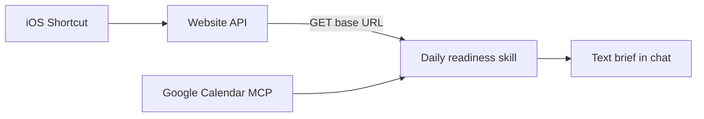

# Daily readiness skill

**Status: draft.** Not approved. Do not implement until this plan is explicitly approved.

Replace the screenshot log with an on-demand Cursor skill that scores the day from website sleep and HRV, Google Calendar load, and steps as effort already spent, then prints a text readiness brief.

This repo becomes the on-demand skill only. The website API, database, and iOS Shortcut stay outside it. The old screenshot log, local `health/` writes, and dashboard are retired as the product. Existing files under `health/` are left untouched and unread. The commit skill stays.

## What the user runs

One skill, [`.agents/skills/daily-readiness/SKILL.md`](../../.agents/skills/daily-readiness/SKILL.md), invoked on demand. It prints four text sections and does not save a score:

- **Readiness** — date, score out of 100, band, change versus yesterday, and one summary sentence that matches the band
- **Recent scores** — today, yesterday, and the day before
- **Do this now** — day-management advice using the score, today’s calendar, and steps so far
- **Last 7 days** — one line per day with the score, oldest to newest

No charts, badges, or “unlock” copy. Heart rate is ignored even if the URL returns it.



## Data the skill reads

**Website.** You have a base URL only. Before implementation, paste that URL. The skill will GET it and expect this JSON (the site can ignore extra Shortcut fields such as heart rate):

```json
{
  "days": [
    {
      "date": "2026-09-22",
      "sleep": { "durationMinutes": 430 },
      "hrv": { "ms": 48 },
      "steps": 4200
    }
  ]
}
```

The array should cover at least the last 7 local days. Missing days stay missing. The skill does not invent values.

**Calendar.** A Google Calendar MCP must already be connected in Cursor. This repo will not build that MCP. The skill reads the primary calendar from 6 days ago through the end of today: title, start, end, and whether the event is all-day. All-day events are ignored. Timed events become a load signal: meeting hours, event count, and whether the day starts before 08:00 or ends after 18:30 in the calendar’s timezone.

If the URL fails or calendar cannot be read, the skill stops and says which source failed. It does not publish a score that pretends the missing source was included.

## How the score is calculated

The skill computes every score. Nothing is written back to the API.

- **Sleep (half of the base score).** 7–9 hours maps to 100. Each 30 minutes outside that window drops the sleep component by about 12 points, floored at 0.
- **HRV (the other half).** Last night’s HRV versus the median of earlier days in the payload (up to 14). Equal to that median maps to 70. About 15% above maps to 100. About 25% below maps to 40. Clamped to 0–100. With fewer than 3 earlier HRV days, the base score is sleep only, and the brief says the HRV baseline is still forming.
- **Calendar penalty, subtracted after the base score.** Under 2 meeting hours: 0. Then roughly −5 at 2–4 hours, −12 at 4–6, −20 above 6. More than 6 timed events: extra −5. First event before 08:00 or last after 18:30: extra −5. Total penalty capped at −30.
- **Steps do not change the number.** They describe effort already spent in “Do this now”: under 3,000 is light so far, 3,000–8,000 is moderate, above 8,000 is already a substantial day.

Bands, and the summary must use the same band as the number:

- 80–100 Optimal — recovery supports the planned day; do not add late commitments if the calendar penalty is already large
- 60–79 Moderate — energy is capped; do not over-commit
- 0–59 Low — keep the day small

“Do this now” names today’s actual free gaps and heavy blocks when calendar data is present, and folds in the steps band. Advice stays practical scheduling guidance. It does not diagnose or prescribe.

Past days in Recent scores and the 7-day list use the same formula, including that day’s calendar. Steps on past days are not shown.

These thresholds are v1 defaults written into the skill so a later change is explicit.

## What gets removed and rewritten

Remove the screenshot feature and its viewer:

- [`.agents/skills/capture-daily-health/`](../../.agents/skills/capture-daily-health/)
- [`.agents/skills/visualize-health-data/`](../../.agents/skills/visualize-health-data/)
- [`web/health-dashboard/`](../../web/health-dashboard/)
- [`scripts/serve_health_dashboard.py`](../../scripts/serve_health_dashboard.py)

Rewrite [`AGENTS.md`](../../AGENTS.md) and [`README.md`](../../README.md) so the project purpose is the readiness skill, the URL contract, the calendar dependency, and the rule that fetched health data is never committed. Keep [`.agents/skills/commit/SKILL.md`](../../.agents/skills/commit/SKILL.md) and the existing `/health/` gitignore.

The skill stores only the base URL, as a config value you supply at implementation time. It does not archive responses.

## Still open before implementation

- The website base URL to GET
- Confirmation of the v1 scoring thresholds above
